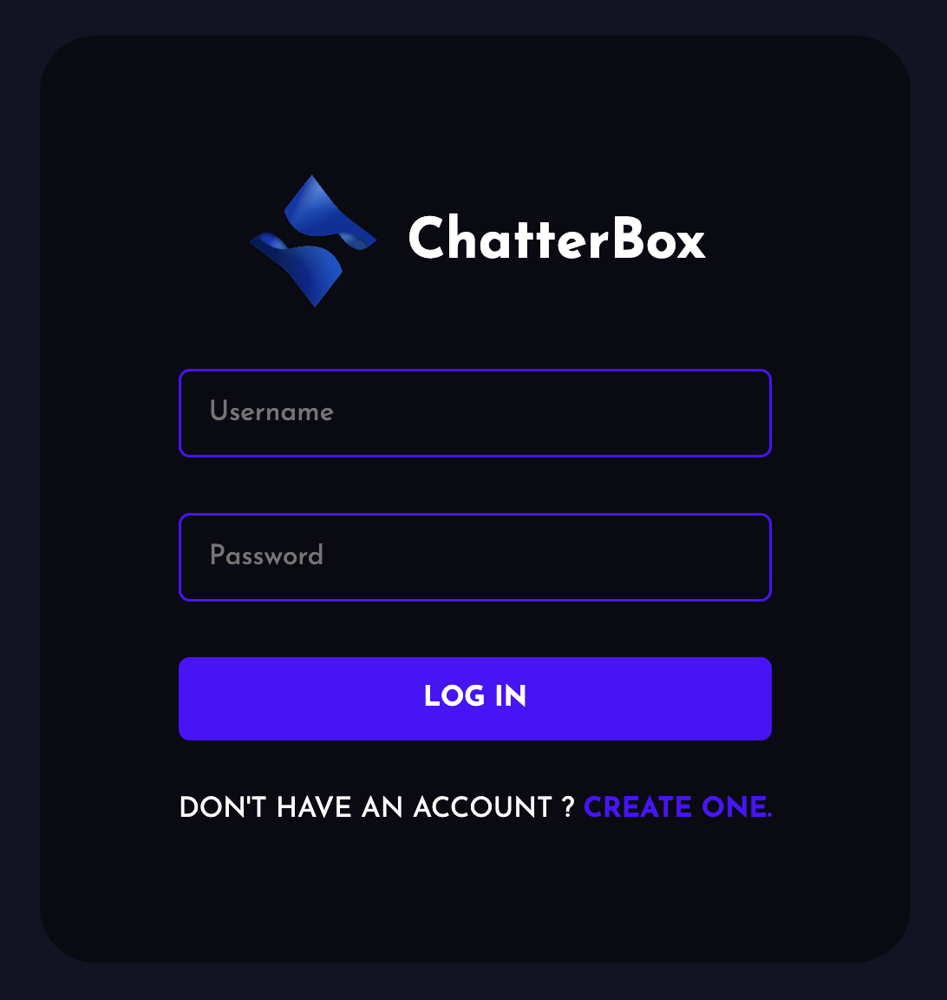
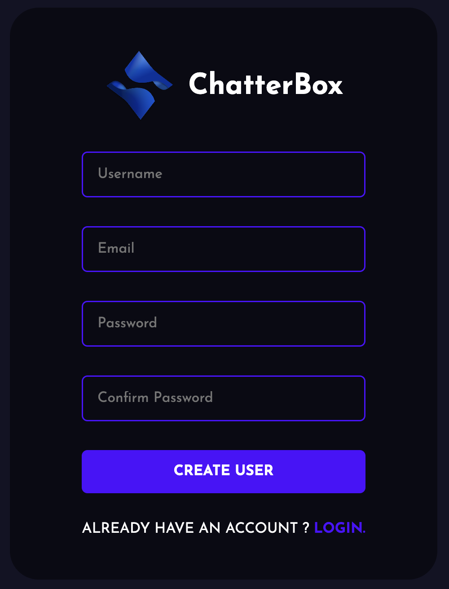
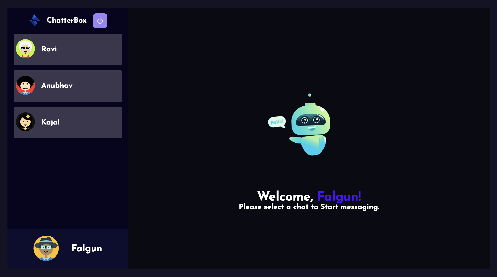
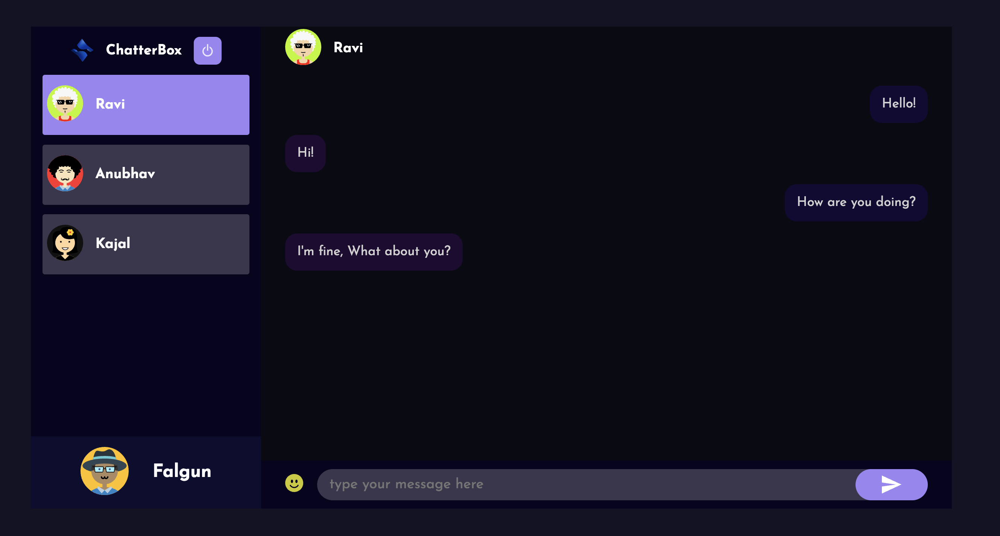
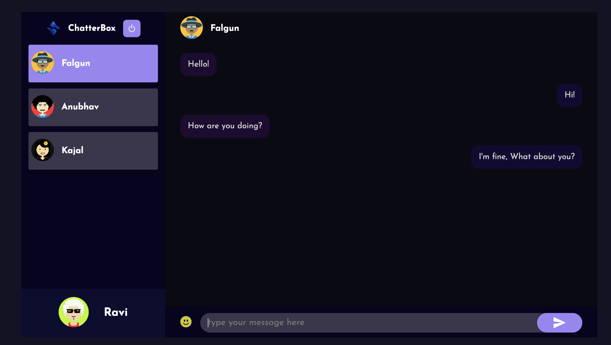

# Chatter-Box

 > ***"ChatterBox" is a cutting-edge real-time chatting application that leverages the power of WebSockets and the MERN (MongoDB, Express, React, Node.js) stack to provide users with a seamless and interactive messaging experience.***

# Screenshots
<figure>
    
    <figcaption style="text-align:center;">Login</figcaption>
</figure>
<figure>
    
    <figcaption style="text-align:center;">Register</figcaption>
</figure>
<figure>
    
    <figcaption style="text-align:center;">Home</figcaption>
</figure>
<figure>
    
    <figcaption style="text-align:center;">Chat1</figcaption>
</figure>
<figure>
    
    <figcaption style="text-align:center;">Chat2</figcaption>
</figure>
